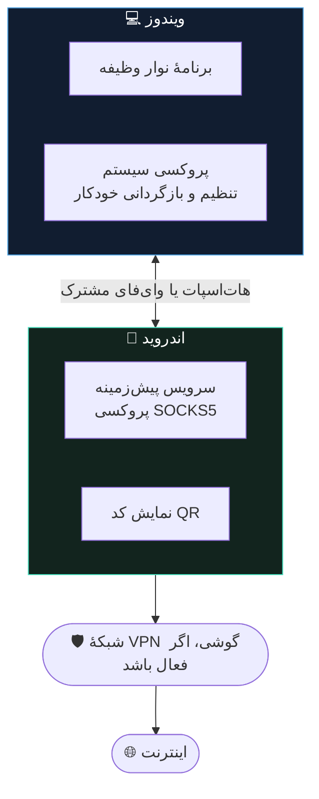

<div align="center">


&nbsp;&nbsp;&nbsp;


# رله ⚡

### **اینترنت گوشی‌ات را با کامپیوترت به اشتراک بگذار.**
### **یک QR اسکن کن. تنظیمات همین بود.**

<br>

[](https://github.com/Mahdi-mortazavi/relay/releases/latest/download/Relay-Setup-x64.exe)
&nbsp;
[](https://github.com/Mahdi-mortazavi/relay/releases/latest/download/Relay-android-arm64-v8a.apk)

<sub>همیشه به جدیدترین نسخه اشاره می‌کند · [همهٔ فایل‌ها و توضیحات نسخه](https://github.com/Mahdi-mortazavi/relay/releases/latest)</sub>

<br>

[](https://github.com/Mahdi-mortazavi/relay/actions/workflows/ci.yml)
[](https://github.com/Mahdi-mortazavi/relay/actions/workflows/e2e.yml)
[](https://github.com/Mahdi-mortazavi/relay/actions/workflows/security.yml)

[](https://github.com/Mahdi-mortazavi/relay/releases/latest)
[](https://github.com/Mahdi-mortazavi/relay/releases)
[](https://github.com/Mahdi-mortazavi/relay/stargazers)
[](LICENSE)

[](#-نصب)
[](#-نصب)
[](android/)
[](windows/)

**🌍 [English](README.md) · [فارسی](README.fa.md)**

</div>

---

<div dir="rtl">

## ⚡ شصت ثانیه، از اول تا آخر

</div>

<div align="center">

| 📱 روی گوشی | 💻 روی کامپیوتر | ✅ تمام |
|:---:|:---:|:---:|
| **شروع اشتراک‌گذاری** را بزن | **Scan QR** را بزن | آنلاین شدی |
| یک QR ظاهر می‌شود | گوشی را جلوی وب‌کم بگیر | از مسیر گوشی‌ات |

</div>

<div dir="rtl">

بدون حساب کاربری. بدون سرویس ابری. بدون آدرس IP، بدون شمارهٔ پورت، و روی هیچ‌کدام از دو دستگاه سراغ تنظیمات شبکه نمی‌روی.

> 🔒 **فقط محلی. بدون هیچ داده‌برداری.** این برنامه‌ها هیچ اتصال شبکه‌ای برقرار نمی‌کنند جز عبور دادن ترافیک خودِ تو بین دو دستگاه خودت. نه تحلیل رفتار، نه حساب کاربری، نه گزارش خطا، نه بررسی به‌روزرسانی. هیچ‌وقت.

---

## 💡 چرا این را ساختم

همیشه به یک دیوار می‌خوردم.

گوشی‌ام اینترنت داشت. گاهی از مسیر یک VPN. لپ‌تاپم هیچی نداشت.

به اشتراک گذاشتن آن اینترنت باید ده ثانیه طول می‌کشید. هیچ‌وقت نکشید.

**روشن کردن هات‌اسپات، اینترنت _خام_ گوشی را رد می‌کرد — نه VPN را.** یعنی دقیقاً همان چیزی که لازم داشتم، همان چیزی بود که رد نمی‌شد.

ابزارهایی که می‌توانستند بهتر عمل کنند، آدرس IP می‌خواستند، شمارهٔ پورت می‌خواستند، و یک سفر به تنظیمات پروکسی ویندوز. هر بار. بدون استثنا.

بعد صفحهٔ گوشی خاموش می‌شد و همه‌چیز بی‌سروصدا قطع می‌شد. نه خطایی، نه اعلانی. فقط... دیگر هیچ‌چیز بالا نمی‌آمد.

و وقتی کارم تمام می‌شد، آن پروکسی‌ای که دستی تنظیم کرده بودم دستی باقی می‌ماند. معمولاً چند روز بعد می‌فهمیدم — وقتی هیچ‌چیز روی لپ‌تاپ به اینترنت نمی‌رسید و نمی‌دانستم چرا.

هرکدام از این‌ها به‌تنهایی مشکل کوچکی است. کنار هم یعنی **دیگر اصلاً سراغش نمی‌رفتم.**

پس چیزی را ساختم که دلم می‌خواست وجود داشته باشد. 🧩

</div>

<div align="center">

### **رله همان چیزی است که «اشتراک‌گذاری اینترنت» از اول باید می‌بود.**

</div>

---

<div dir="rtl">

## 🔧 چطور کار می‌کند

</div>



<div dir="rtl">

چون **گوشی است که سوکت‌های خروجی را باز می‌کند**، هر VPN‌ای که روی گوشی فعال باشد ترافیک لپ‌تاپ را هم حمل می‌کند — از جمله DNS. تمام ترفند همین است، و دلیل اینکه رله مشکلی را حل می‌کند که هات‌اسپات نمی‌تواند.

کد QR یک محتوای کوچک و نسخه‌دار دارد: یک آدرس، یک پورت، و اینکه از کدام مسیر انتقال استفاده شود. **هیچ پروتکل کشف و هیچ سرور جفت‌سازی‌ای در کار نیست** — و دقیقاً به همین دلیل وقتی VPN روشن است هم کار می‌کند. VPNهای سیستمی در اندروید ۱۰ به بعد کشف شبکهٔ محلی را می‌شکنند، و رله اصلاً چیزی را کشف نمی‌کند.

وقتی قطع می‌کنی، رله تنظیمات پروکسی ویندوز را **دقیقاً** همان‌طور که پیدایشان کرده بود برمی‌گرداند — بعد رجیستری را دوباره می‌خواند تا مطمئن شود واقعاً انجام شده.

<sub>📐 جزئیات بیشتر در [`docs/architecture.md`](docs/architecture.md)</sub>

---

## 📥 نصب

دو فایل. بدون نیاز به کامپایل. این لینک‌ها همیشه به جدیدترین نسخه اشاره می‌کنند:

| | دانلود | نیازمندی |
|:---|:---|:---|
| **💻 ویندوز** | [**Relay-Setup-x64.exe**](https://github.com/Mahdi-mortazavi/relay/releases/latest/download/Relay-Setup-x64.exe) | ویندوز ۱۰ یا ۱۱. نصب برای کاربر جاری — بدون دسترسی مدیر. |
| 💻 ویندوز ۳۲ بیتی | [Relay-Setup-x86.exe](https://github.com/Mahdi-mortazavi/relay/releases/latest/download/Relay-Setup-x86.exe) | فقط اگر مطمئنی لازم داری. |
| **📱 اندروید** | [**Relay-arm64-v8a.apk**](https://github.com/Mahdi-mortazavi/relay/releases/latest/download/Relay-android-arm64-v8a.apk) | اندروید ۸ به بالا، پردازندهٔ ۶۴ بیتی ARM — تقریباً هر گوشی بعد از ۲۰۱۷. «نصب از منابع ناشناس» را فعال کن. |
| 📱 اندروید (هر دستگاهی) | [Relay-android-universal.apk](https://github.com/Mahdi-mortazavi/relay/releases/latest/download/Relay-android-universal.apk) | همان برنامه، برای همهٔ نوع پردازنده‌ها — ARM ۳۲ بیتی، کروم‌بوک x86، شبیه‌ساز. حجیم‌تر. **اگر بالایی گفت «برنامه سازگار نیست»، این را بگیر.** |
| 📱 اندروید (فروشگاه) | [Relay-android.aab](https://github.com/Mahdi-mortazavi/relay/releases/latest/download/Relay-android.aab) | بستهٔ فروشگاهی — مستقیم نصب نمی‌شود. |

> ⚠️ **در اجرای اول، SmartScreen هشدار می‌دهد.** نصب‌کنندهٔ ویندوز هنوز امضای دیجیتال ندارد، پس **More info → Run anyway** را بزن. هر نسخه فایل `SHA256SUMS.txt` هم دارد تا بتوانی دقیقاً بررسی کنی چه چیزی دانلود کرده‌ای. کار امضا در [`docs/release.md`](docs/release.md) پیگیری می‌شود.

---

## 🚀 استفاده

۱. روی گوشی **هات‌اسپات را روشن کن** و کامپیوتر را به آن وصل کن — یا هر دو را روی یک Wi-Fi بگذار.
۲. رله را روی گوشی باز کن → **شروع اشتراک‌گذاری** را بزن.
۳. رله را روی کامپیوتر باز کن (در نوار وظیفه است) → **Scan QR** را بزن → گوشی را جلوی وب‌کم بگیر.
   <br><sub>وب‌کم نداری؟ **Enter Code Manually** را بزن و کد ۸ کاراکتری زیر QR را تایپ کن. همان‌طور که تایپ می‌کنی اعتبارسنجی می‌شود و به‌محض معتبر شدن، خودش وصل می‌شود.</sub>
۴. کامپیوتر **Connected** را نشان می‌دهد. عادی استفاده کن. 🎉
۵. در پایان روی کامپیوتر **Disconnect** یا روی گوشی **توقف** را بزن.

💤 **گوشی با صفحهٔ خاموش هم به اشتراک‌گذاری ادامه می‌دهد.** در اجرای اول پیشنهاد می‌کند از بهینه‌سازی باتری معاف شود — قبول کن، وگرنه اندروید دیر یا زود اتصال را می‌بندد.

📡 **رله فعلاً TCP را عبور می‌دهد**، که مرور وب، پخش ویدیو، دانلود و بیشتر برنامه‌ها را پوشش می‌دهد. UDP — بازی‌ها و بعضی تماس‌های تصویری — به مسیر انتقال WireGuard نیاز دارد که [در نقشهٔ راه](docs/roadmap.md) هست و **در این نسخه وجود ندارد**. برنامه این گزینه را نشان نمی‌دهد، به‌جای اینکه نشان بدهد و شکست بخورد.

---

## 🔐 امن است؟ جواب صریح

**خلاصه: روی هات‌اسپات خودت مشکلی نیست. روی شبکهٔ یک کافه خصوصی نیست.**

مسیر انتقال رله یک پروکسی SOCKS5 **بدون احراز هویت** است — چون پروکسی سیستمی ویندوز هیچ راهی برای دادن نام کاربری و رمز ندارد. پس هرکس دیگری روی همان شبکه که پورت را پیدا کند، می‌تواند ترافیکش را از گوشی تو عبور دهد.

این یک محدودیت واقعی است و به‌جای یک پاورقی، جواب صریح می‌خواهد.

👈 **[SECURITY.md](SECURITY.md)** مدل تهدید کامل، چیزهایی که رله تضمین می‌کند، و روش گزارش خصوصی آسیب‌پذیری را دارد.

---

## 🧪 چطور تست می‌شود (به این بخش افتخار می‌کنم)

رله تنظیمات شبکهٔ سیستم‌عامل را تغییر می‌دهد. برای چنین چیزی «روی سیستم من کار می‌کرد» کافی نیست.

**روی هر Pull Request یک آزمایشگاه دستگاه اجرا می‌شود که خودِ GitHub از صفر می‌سازد:**

| | چه چیزی واقعاً اجرا می‌شود |
|:---|:---|
| 📱 **اندروید واقعی** | APK واقعی روی شبیه‌سازهای واقعی (API ۳۰ و ۳۴)، هدایت از طریق رابط کاربری واقعی، عبور ترافیک واقعی HTTP از سرور SOCKS5 واقعی |
| 🔗 **بین‌پلتفرمی واقعی** | کد خودِ کلاینت ویندوز مقابل یک گوشی زنده از طریق `adb` — رمزگشای واقعی محتوای QR واقعی گوشی را می‌خواند و بایت‌های واقعی بین دو پلتفرم رد و بدل می‌شود |
| 💻 **نصب‌کنندهٔ واقعی** | نصب ← اجرا ← اسکرین‌شات ← بازگردانی ← حذف، با خواندن دوبارهٔ رجیستری پروکسی و مقایسه **بعد از هر مرحله** |

و آنچه این آزمایشگاه **نمی‌تواند** پوشش دهد — اسکن فیزیکی با دوربین، خودکارسازی کنترل‌های WinUI، حالت Sleep ویندوز — در [`docs/testing.md`](docs/testing.md) صریحاً به‌عنوان **مسدود** ثبت شده، نه اینکه بی‌صدا نادیده گرفته شود.

<sub>نکته دقیقاً همین جملهٔ آخر است. یک تیک سبز که یک مسیر تست‌نشده را پنهان کند، از نبودِ تیک بدتر است.</sub>

---

## 🗺️ نقشهٔ راه

وضعیت صادقانه، نه فهرست آرزو.

| قابلیت | وضعیت |
|:---|:---|
| ⚡ حالت سریع (SOCKS5، TCP) | ✅ **در دسترس** |
| 🔄 اتصال مجدد خودکار، خطاهای قابل‌اقدام، انگلیسی + فارسی | ✅ **در دسترس** |
| 🎨 بازطراحی برنامهٔ ویندوز | ✅ **در دسترس** |
| 🚀 حالت کامل (WireGuard، TCP + UDP) | 🔨 برنامه‌ریزی‌شده |
| 🔑 جفت‌سازی با احراز هویت | 🔨 برنامه‌ریزی‌شده — [SECURITY.md](SECURITY.md) |
| ✍️ نصب‌کنندهٔ امضاشدهٔ ویندوز | 🔨 برنامه‌ریزی‌شده |
| 🍎 کلاینت مک‌اواس | 💭 بعداً |

<sub>جزئیات در [`docs/roadmap.md`](docs/roadmap.md)</sub>

---

## ⭐ روند ستاره‌ها

اگر رله یک دردسر را از تو کم کرد، یک ستاره واقعاً کمک می‌کند بقیه پیدایش کنند.

</div>

<div align="center">
<a href="https://star-history.com/#Mahdi-mortazavi/relay&Date">
  <picture>
    <source media="(prefers-color-scheme: dark)" srcset="https://api.star-history.com/svg?repos=Mahdi-mortazavi/relay&type=Date&theme=dark" />
    <source media="(prefers-color-scheme: light)" srcset="https://api.star-history.com/svg?repos=Mahdi-mortazavi/relay&type=Date" />
    
  </picture>
</a>
</div>

---

<div align="center">

## 👋 با سازنده آشنا شو


### **مهدی مرتضوی** · Mahdi Mortazavi

**توسعه‌دهندهٔ فول‌استک × سازندهٔ محصول × حل‌کنندهٔ مسئله**

🧩 تفکر از اصول اولیه ← 💡 طراحی راه‌حل ← 🚀 ساختن محصول واقعی

<sub>📍 ایران</sub>

</div>

<div dir="rtl">

من دموی تبلیغاتی نمی‌سازم. چیزی را می‌سازم که خودم لازم دارم، بعد آن‌قدر خوبش می‌کنم که بشود دست کسی دیگر داد.

رله از سرخوردگی خودم شروع شد. حالا روی هر کامیت یک آزمایشگاه دستگاه اجرا می‌کند، روی دو پلتفرم نسخهٔ منتشرشده می‌دهد، و دربارهٔ کارهایی که **نمی‌تواند** انجام دهد راستش را می‌گوید. **استانداردی که کارم را با آن می‌سنجم همین است.**

</div>

<div align="center">

### 💬 بیا حرف بزنیم

[](https://t.me/Startup_legend)

[](https://t.me/Mahdi_mortazavi1)
&nbsp;
[](mailto:Mahdi.mortazavi.135@gmail.com)

[](https://github.com/Mahdi-mortazavi)
&nbsp;
[](https://mahdi-mortazavi.github.io)

**🚀 [استارتاپ لجند](https://t.me/Startup_legend)** — کامیونیتی من، جایی که از چیزهایی که می‌سازم می‌نویسم، از چیزهایی که خراب شد، و از چیزهایی که موقع درست کردنشان یاد گرفتم. سازنده، فاندر و توسعه‌دهنده — همه خوش‌آمدند.

</div>

---

<div align="center">

## 🤝 مشارکت کن

</div>

<div dir="rtl">

**باگ پیدا کردی؟** [یک issue باز کن](https://github.com/Mahdi-mortazavi/relay/issues/new/choose) — همه را می‌خوانم.

**ایده داری؟** [در تلگرام پیام بده](https://t.me/Mahdi_mortazavi1) یا در [کامیونیتی](https://t.me/Startup_legend) مطرحش کن.

**می‌خواهی کد بزنی؟** [`CONTRIBUTING.md`](CONTRIBUTING.md) روند کار را دارد. issueهای مناسب شروع، برچسب خورده‌اند.

**فقط برایت مفید بود؟** ⭐ ستاره بده. یک کلیک است و واقعاً اثر دارد.

</div>

<div align="center">

<br>

[](https://github.com/Mahdi-mortazavi/relay/stargazers)
&nbsp;
[](https://github.com/Mahdi-mortazavi/relay/issues/new/choose)

</div>

---

<div dir="rtl">

## 🛠️ برای توسعه‌دهنده‌ها

</div>

<details>
<summary><b>📂 ساختار پروژه</b></summary>

<br>

```
android/   اپلیکیشن اندروید (Kotlin + Jetpack Compose)
windows/   اپلیکیشن ویندوز (.NET 8 + WinUI 3) به‌همراه Relay.Core مشترک
shared/    قراردادهای مشترک: اسکیمای QR، بردارهای تست، ماشین حالت، توکن‌های طراحی
docs/      معماری، ADRها، تست، امنیت، فرایند انتشار
```

<div dir="rtl">

**هرچه در `shared/` هست تنها منبع حقیقت است.** **اول** آن را تغییر بده، بعد هر دو پلتفرم را — تست‌های واحد هر طرف مقابل همان فایل‌ها بررسی می‌شوند، پس دو پیاده‌سازی نمی‌توانند از هم فاصله بگیرند.

</div>

</details>

<details>
<summary><b>🤖 ساخت اندروید</b></summary>

<br>

<div dir="rtl">

به JDK 17 و Android SDK با پلتفرم ۳۵ نیاز دارد.

</div>

```bash
cd android
./gradlew assembleDebug          # ساخت APK دیباگ
./gradlew testDebugUnitTest      # تست‌های واحد، شامل مجموعهٔ پروتکل SOCKS5
```

</details>

<details>
<summary><b>🪟 ساخت ویندوز</b></summary>

<br>

<div dir="rtl">

هستهٔ مشترک دات‌نت ۸ است و روی **هر** سیستم‌عاملی اجرا می‌شود:

</div>

```bash
dotnet test windows/Relay.App.Tests/Relay.App.Tests.csproj
```

<div dir="rtl">

خودِ اپلیکیشن به ویندوز و MSBuild ویژوال استودیو نیاز دارد — تسک‌های بسته‌بندی PRI در WinUI 3 در MSBuild خط فرمان dotnet نیستند:

</div>

```powershell
msbuild windows/Relay.App/Relay.App.csproj /restore /p:Configuration=Release /p:Platform=x64
```

</details>

<details>
<summary><b>📖 مستنداتی که ارزش خواندن دارند</b></summary>

<br>

<div dir="rtl">

| سند | محتوا |
|:---|:---|
| [`docs/architecture.md`](docs/architecture.md) | دو برنامه چطور کنار هم کار می‌کنند |
| [`docs/adr/`](docs/adr/) | **چرا** معماری این شکلی است — از ADR-0001 شروع کن |
| [`docs/testing.md`](docs/testing.md) | آزمایشگاه دستگاه چه چیزی را اجرا می‌کند و به چه چیزی نمی‌رسد |
| [`docs/design/windows-redesign.md`](docs/design/windows-redesign.md) | بازطراحی رابط ویندوز، قبل ← بعد |
| [`docs/security.md`](docs/security.md) · [`SECURITY.md`](SECURITY.md) | مدل تهدید و گزارش آسیب‌پذیری |
| [`docs/roadmap.md`](docs/roadmap.md) | وضعیت صادقانهٔ همهٔ چیزهای برنامه‌ریزی‌شده |

</div>

</details>

---

<div align="center">

### 📄 پروانه

[**Apache-2.0**](LICENSE) — استفاده کن، فورک کن، منتشر کن.

<sub>«WireGuard» علامت تجاری ثبت‌شدهٔ Jason A. Donenfeld است.</sub>

<br>

**ساخته‌شده با دقت توسط [مهدی مرتضوی](https://github.com/Mahdi-mortazavi)** 🇮🇷

<sub>اگر وقتت را ذخیره کرد، [بهم بگو](https://t.me/Mahdi_mortazavi1). بهترین بخش ساختن همین است.</sub>

</div>
