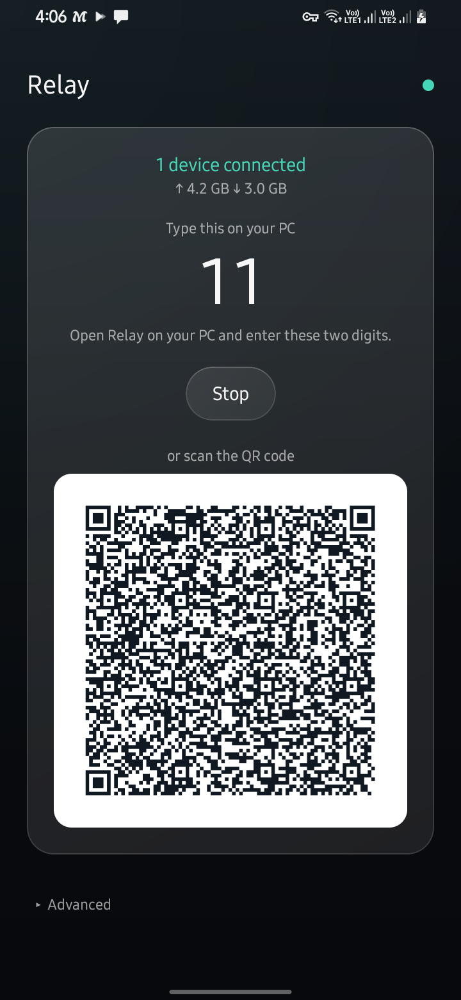
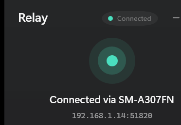

<div align="center">

<picture>
  <source media="(max-width: 640px)" srcset="docs/assets/cover-mobile.svg">
  
</picture>

<br>

### **لپ‌تاپت اینترنت ندارد. گوشی‌ات دارد.**
### **ریلی آن را جابه‌جا می‌کند — در حدود پنج ثانیه.**

<br>

[](https://github.com/Mahdi-mortazavi/relay/releases/latest/download/Relay-Setup-x64.exe)
&nbsp;
[](https://github.com/Mahdi-mortazavi/relay/releases/latest/download/Relay-android-arm64-v8a.apk)

<sub>همیشه آخرین نسخه · [همه‌ی فایل‌ها و توضیحات](https://github.com/Mahdi-mortazavi/relay/releases/latest)</sub>

<br>

[](https://github.com/Mahdi-mortazavi/relay/actions/workflows/ci.yml)
[](https://github.com/Mahdi-mortazavi/relay/actions/workflows/e2e.yml)
[](https://github.com/Mahdi-mortazavi/relay/releases/latest)
[](LICENSE)
[](https://github.com/Mahdi-mortazavi/relay/stargazers)

**🌍 [English](README.md) · [فارسی](README.fa.md)**

</div>

---

<div dir="rtl">

سلام، من **مهدی** هستم. ریلی را ساختم چون مدام به این وضعیت می‌خوردم: لپ‌تاپی که
اینترنت نداشت و گوشی‌ای که داشت — و هر راه‌حلی از خودِ مشکل بدتر بود. تترینگ USB
که درایور می‌خواست، هات‌اسپاتی که باتری را می‌خورد، و برنامه‌هایی که برای کاری که
اصلاً لازم نیست از روی میز من بیرون برود، حساب کاربری می‌خواستند.

**ریلی یعنی reverse tethering، درست‌وحسابی.** گوشی‌ات اینترنتش را از داخل یک تونل
رمزنگاری‌شده‌ی **WireGuard** با کامپیوترت به اشتراک می‌گذارد — روی وای‌فای خودت یا
هات‌اسپات گوشی. تمام برنامه‌های کامپیوتر از آن رد می‌شوند، **هم TCP و هم UDP**، پس
بازی و تماس تصویری و نصب‌کننده‌ها هم کار می‌کنند، نه فقط مرورگر.

**بدون روت. بدون حساب کاربری. بدون سرور. هیچ‌چیز از این دو دستگاه بیرون نمی‌رود.**

</div>

<br>

<div align="center">


&nbsp;&nbsp;

&nbsp;&nbsp;


<sub>**راست:** کامپیوتر، آماده‌ی اتصال. **چپ:** گوشی، در حال اشتراک‌گذاری.</sub>

</div>

---

<div dir="rtl">

## ⚡ راه‌اندازی، در حدود پنج ثانیه

</div>

<div align="center">

| ۳️⃣ | ۲️⃣ | ۱️⃣ |
|:---:|:---:|:---:|
| **تمام** | **کامپیوتر** | **گوشی** |
| روی گوشی تأیید کن | گوشی را از لیست انتخاب کن<br><sub>یا دو رقم را تایپ کن</sub> | **Start Sharing** را بزن |

</div>

<div dir="rtl">

همه‌اش همین است. کامپیوتر خودش گوشی‌هایی را که در حال اشتراک‌گذاری‌اند پیدا می‌کند،
پس معمولاً چیزی برای تایپ‌کردن هم نیست. دوربین نداری؟ دو رقم را تایپ کن. لیست
نیامد؟ QR را اسکن کن.

</div>

---

<div dir="rtl">

## 🎬 ببین چطور کار می‌کند

**KASRA MAX** یک آموزش کامل ساخته — روایت فارسی با زیرنویس انگلیسی، حدود چهار
دقیقه، از نصب تا گشت‌وگذار.

</div>

<div align="center">

<video src="https://raw.githubusercontent.com/Mahdi-mortazavi/relay/main/docs/assets/relay-demo-kasra.mp4" poster="docs/assets/video-kasra-thumb.jpg" controls muted playsinline width="720"></video>

<sub>▶︎ چهار دقیقه، روایت فارسی با زیرنویس انگلیسی. اگر اینجا پخش نشد <a href="https://raw.githubusercontent.com/Mahdi-mortazavi/relay/main/docs/assets/relay-demo-kasra.mp4">مستقیم بازش کن</a>.</sub>

</div>

<div dir="rtl">

> 🙏 **کسرا جان، ممنونم.** او سه باگ واقعی را هم پیدا کرد، فقط با درست استفاده‌کردن
> از ریلی و دقیق گزارش‌دادن آنچه دیده بود — از جمله
> [همانی که پیام تأیید هیچ‌وقت نمی‌آمد](https://github.com/Mahdi-mortazavi/relay/releases/tag/v2.7.1)،
> که آخرش معلوم شد دو ایراد جدا بوده که پشت هم پنهان شده بودند. گزارش‌هایی مثل
> گزارش او از هر تستی که خودم بنویسم باارزش‌ترند، چون از جایی می‌آیند که من
> نگاه نمی‌کردم.

</div>

---

<div dir="rtl">

## 📥 دانلود


**همین برنامه است.** برای هر دستگاه یک فایل، هر دو از همان بیلدی که تست‌های این صفحه
را اجرا می‌کند. چیز دیگری برای نصب نیست و حسابی هم نباید بسازی.

<br clear="right">

| | فایل | برای چه کسی |
|---|---|---|
| **ویندوز** | [**Relay-Setup-x64.exe**](https://github.com/Mahdi-mortazavi/relay/releases/latest/download/Relay-Setup-x64.exe) | ویندوز ۱۰/۱۱. فقط برای خودت نصب می‌شود — بدون ادمین. |
| ویندوز ۳۲ بیتی | [Relay-Setup-x86.exe](https://github.com/Mahdi-mortazavi/relay/releases/latest/download/Relay-Setup-x86.exe) | فقط اگر مطمئنی به آن نیاز داری. |
| **اندروید** | [**Relay-android-arm64-v8a.apk**](https://github.com/Mahdi-mortazavi/relay/releases/latest/download/Relay-android-arm64-v8a.apk) | اندروید ۸ به بالا. تقریباً هر گوشی بعد از ۲۰۱۷. |
| اندروید (همه) | [Relay-android-universal.apk](https://github.com/Mahdi-mortazavi/relay/releases/latest/download/Relay-android-universal.apk) | حجیم‌تر، ولی همه‌جا کار می‌کند. اگر فایل بالا گفت *«برنامه سازگار نیست»* این را بگیر. |
| چک‌سام | [SHA256SUMS.txt](https://github.com/Mahdi-mortazavi/relay/releases/latest/download/SHA256SUMS.txt) | `sha256sum -c SHA256SUMS.txt` |

> **ویندوز موقع اجرای اول هشدار می‌دهد** چون نصب‌کننده هنوز امضای دیجیتال ندارد — **More info ← Run anyway**.
> **اندروید می‌گوید «App not installed»؟** [همه‌ی دلایلی که دیده‌ام این‌جاست](docs/install-troubleshooting.md).

</div>

---

<div dir="rtl">

## ✨ همه‌ی امکانات ریلی

### 🌐 اشتراک‌گذاری

| | |
|---|---|
| **یک تونل WireGuard** | هم TCP و هم UDP — پس بازی، تماس و نصب‌کننده‌ها هم به اشتراک گذاشته می‌شوند، نه فقط مرورگر |
| **همه‌ی برنامه‌ها** | هیچ تنظیمی برای هر برنامه لازم نیست؛ کل ماشین از مسیر گوشی می‌رود |
| **بدون روت** | روی هیچ‌کدام از دو دستگاه |
| **آمار زنده** | سرعت دانلود و آپلود، مجموع، تأخیر تونل و مدت اتصال، خوانده‌شده از خود آداپتر |
| **وضعیت صادق** | «متصل» یعنی یک handshake واقعی WireGuard انجام شده، نه اینکه صرفاً آداپتری وجود دارد |
| **دنبال‌کردن گوشی** | تغییر آدرس — تمدید DHCP، عوض‌شدن وای‌فای، NAT rebinding — تونل را دوباره هدایت می‌کند، نه اینکه بکشد |
| **مقاوم در برابر شبکه‌ی بد** | تست‌شده با ۵٪ packet loss، قطعی کامل، و تغییر مسیر وسط انتقال |
| **اتصال مجدد** | بازیابی خودکار با سقف مشخص، وقتی هات‌اسپات قطع می‌شود ([ADR-0007](docs/adr/0007-bounded-auto-reconnect.md)) |

### 🔗 جفت‌شدن

| | |
|---|---|
| **یک کلیک** | گوشی‌هایی که در حال اشتراک‌گذاری‌اند در صفحه‌ی اول کامپیوتر ظاهر می‌شوند |
| **کد دو رقمی** | برای لپ‌تاپی که دوربین ندارد |
| **کد QR** | وب‌کم را جلوی گوشی بگیر |
| **تأیید با خودت** | گوشی قبل از تحویل کلیدها می‌پرسد و آدرس همان کامپیوتر را نشان می‌دهد — هم داخل برنامه و هم **در نوار نوتیفیکیشن**، تا وقتی به لپ‌تاپ نگاه می‌کنی هم به تو برسد |

### 🛡️ محافظت از نشت

پیش‌فرض روشن، با قوانین Windows Filtering Platform که خود تونل نصبشان می‌کند.

| بسته می‌شود | دست‌نخورده می‌ماند |
|---|---|
| DNS به هر resolver دیگری جز resolver تونل | `localhost` و loopback، هم v4 و هم v6 |
| خروج IPv6 از دستگاه | IPv4 عادی |
| | **ترافیک VPNهای دیگر** — هیچ پورتی جز ۵۳ لمس نمی‌شود |

هزینه‌ی اندازه‌گیری‌شده: **۲۲ میکروثانیه به ازای هر اتصال جدید، و صفر به ازای هر
بایت.** قوانین در سشنی زندگی می‌کنند که ویندوز لحظه‌ای که پروسه‌ی تونل تمام شود
پاکشان می‌کند — حتی اگر kill شود. یک ریلیِ مرده نمی‌تواند ماشینت را بدون
نام‌گشایی رها کند.

### 📱 روی گوشی

| | |
|---|---|
| **تایل Quick Settings** | شروع و توقف از نوار پایین‌کشیدنی، با کد جفت‌شدن در زیرنویس |
| **ویجت صفحه‌ی اصلی** | کد، به‌اندازه‌ای بزرگ که وقتی به لپ‌تاپ نگاه می‌کنی بخوانی‌اش |
| **شورتکات لمس طولانی** | *Start Sharing* مستقیم از آیکون برنامه |
| **راه‌اندازی اولین اجرا** | نوتیفیکیشن، معافیت باتری، تایل و ویجت را توضیح می‌دهد — و هرجا اندروید اجازه دهد خودش اضافه می‌کند |
| **سه کانال نوتیفیکیشن جدا** | اشتراک‌گذاری، به‌روزرسانی و درخواست تأیید، هرکدام مستقل قابل خاموش‌کردن |
| **آیکون Themed** | روی اندروید ۱۳ به بالا با پالت والپیپرت هماهنگ می‌شود |

### 💻 روی کامپیوتر

| | |
|---|---|
| **زندگی در سینی سیستم** | با دکمه‌های کوچک‌کردن و بستن، و Alt-Tab برای برگشت |
| **اجرا با ویندوز** | یک سوییچ در Advanced، با کلید per-user — بدون نیاز به ادمین |
| **نوتیفیکیشن اتصال** | وقتی تونل بالا می‌آید — و اگر بدون محافظت بالا آمده باشد، به‌جایش هشدار |
| **گزارش تشخیصی** | یک دکمه، هرچه یک گزارش باگ لازم دارد را کپی می‌کند — و هیچ‌چیز آپلود نمی‌شود |

### 🔄 به‌روزرسانی

**ویندوز خودش را به‌روز می‌کند.** کمی بعد از اجرا و بعد روزی یک‌بار بررسی می‌کند،
می‌گوید چه پیدا کرده، و در اولین لحظه‌ای که تونل پایین باشد نصب می‌کند — چون نصب
یعنی متوقف‌کردن ریلی، و این کار وسط یک تماس آن تماس را قطع می‌کند. خودش بسته
می‌شود، به‌روز می‌شود، و برمی‌گردد.

**اندروید هم موقع باز کردن برنامه و هم موقع شروع اشتراک‌گذاری بررسی می‌کند**، تا
کاربر تایل و ویجت هم باخبر شود، و بعد به‌روزرسانی را پیشنهاد می‌دهد. اندروید به
هیچ اپ سایدلودی اجازه‌ی نصب بی‌صدا نمی‌دهد؛ آخرین لمس همیشه با توست.

در هر دو حالت فایل دانلودشده با **`SHA256SUMS.txt` منتشرشده در همان ریلیز**
تطبیق داده می‌شود. هرچه رد شود پاک می‌شود، نه اینکه نگه داشته شود. ریلی کل اتصال
تو را حمل می‌کند، پس «خودش را جایگزین کند» باید یعنی «دقیقاً با همان بایت‌هایی که
ریلیز منتشر کرده».

### 🌍 هر دو

فارسی و انگلیسی در سراسر برنامه، با راست‌به‌چپ درست، و هر متنی که کاربر می‌بیند با
تست اجباری شده. بیست‌ویک کد خطا، هرکدام با توضیح انسانی در
[`docs/errors.md`](docs/errors.md).

</div>

---

<div dir="rtl">

## 🔒 هیچ چیزی از دستگاه‌های تو بیرون نمی‌رود

این بخشی است که بیشتر از همه برایم مهم است، پس یک قانون است نه یک ترجیح:

- **بدون حساب، بدون سرور، بدون telemetry، بدون analytics.** چیزی برای ثبت‌نام وجود ندارد، و جایی برای رفتن داده‌ات هم نیست.
- **تونل، WireGuard است.** کلیدهایش به ازای هر جفت‌شدن ساخته می‌شوند و با توقف اشتراک‌گذاری نابود می‌شوند.
- **کلیدها هرگز broadcast نمی‌شوند.** گوشی فقط آن‌قدر اعلام می‌کند که *پیدا* شود. کلیدها در یک تبادل کوتاه رد و بدل می‌شوند که خودت روی صفحه تأییدش می‌کنی، با آدرس همان کامپیوتر جلوی چشمت.
- **هیچ‌چیز از پروسه عمر بیشتری ندارد.** ریلی هیچ تنظیم سیستمی را تغییر نمی‌دهد، پس یک کرش نمی‌تواند ماشینت را در وضعیت خراب رها کند.

تغییری که یک درخواست شبکه به هر جایی جز گوشی خودت اضافه کند، دلیل خیلی خوبی و یک سند تصمیم مکتوب لازم دارد. این قانون در [`CLAUDE.md`](CLAUDE.md) و [ADRها](docs/adr/) اجباری شده است.

</div>

---

<div dir="rtl">

## 🧪 چطور تست می‌شود

هر کامیت، برنامه‌ی واقعی را روی ایمیج‌های واقعی اندروید (API ۳۰ تا ۳۶) نصب می‌کند و از طریق رابط کاربری خودش پیش می‌برد: شروع اشتراک‌گذاری، نمایش QR، جفت‌شدن یک لپ‌تاپ با کد، پاسخ به درخواست، توقف. کلاینت ویندوز در برابر یک **گوشی زنده** از طریق `adb` اجرا می‌شود. نصب‌کننده‌ی واقعی نصب، اجرا و حذف می‌شود. تونل روی یک آداپتور واقعی WinTun بالا می‌آید و یک هند‌شیک واقعی WireGuard روی آن تأیید می‌شود.

بعد، APK **منتشرشده** روی اندروید ۱۱ تا ۱۶ نصب می‌شود — چون نسخه‌ای که کسی نتواند نصبش کند، نسخه نیست.

**آنچه سخت‌افزار هنوز ثابت نکرده** در [docs/testing.md](docs/testing.md) نوشته شده، نه پنهان. یک پایپ‌لاین که تنها تست معنادارش را رد کرده باشد هم سبز است، پس نام تست‌هایی که اهمیت دارند ثبت شده و اگر یکی بی‌صدا رد شود CI شکست می‌خورد.

</div>

---

<div dir="rtl">

## 🗺️ کارهای بعدی

| | |
|:---|:---|
| ✍️ **نصب‌کننده‌ی امضاشده‌ی ویندوز** | 🔨 بعدی — همان هشدار SmartScreen است که کاربر را متوقف می‌کند |
| 🧩 **Split tunnel و مسیریابی هر برنامه جدا** | 🔨 بعدی — الان تونل همه‌یاهیچ است |
| 📵 **اشتراک گوشی‌ای که خودش روی VPN است** | 🔨 تشخیص داده و توضیح داده می‌شود، ولی هنوز حل نشده |
| 🐧 **کلاینت لینوکس** | 💭 خواسته شده، و بهترین جا برای مشارکت — [#74](https://github.com/Mahdi-mortazavi/relay/issues/74) |
| 🍎 **کلاینت مک** | 💭 بعداً |
| 🌐 **IPv6** | 💭 بعداً — تونل فعلاً IPv4 است |
| 👥 **بیش از یک کامپیوتر در یک نشست** | 🚫 برنامه‌ای نیست — طبق طراحی هر نشست یک peer دارد |
| ☁️ **حساب کاربری، سرور، تله‌متری** | 🚫 هرگز |

**محدودیت شناخته‌شده:** اگر VPN خود گوشی، UID ریلی را بگیرد، ترافیک تونل توسط
همان VPN بلعیده می‌شود. ریلی این را تشخیص می‌دهد و می‌گوید، ولی از داخل برنامه
نمی‌تواند حلش کند.

**آنچه هنوز روی سخت‌افزار ثابت نشده:** آنچه CI نمی‌تواند به آن برسد در
[docs/testing.md](docs/testing.md) نوشته شده، نه پنهان.

<sub>تصویر کامل همراه با دلایل: [**ROADMAP.md**](ROADMAP.md)</sub>

</div>

---

<div dir="rtl">

## 🛠️ برای توسعه‌دهنده‌ها

دو اپلیکیشن و یک قرارداد مشترک.

</div>

```
android/   Kotlin + Compose            windows/   .NET 8 + WinUI 3
wg/        WireGuard endpoint (Go)     shared/    قرارداد بین دو پلتفرم
docs/      معماری، ADRها، تست، خطاها
```

<div dir="rtl">

**هیچ مرحله‌ی بیلد محلی وجود ندارد.** CI همان سیستم بیلد است ([ADR-0004](docs/adr/0004-github-only-build-and-release.md)) — یک برنچ push کن و پایپ‌لاین آن را می‌سازد، روی دستگاه واقعی تست می‌کند و می‌تواند نسخه بدهد. برای مشارکت **نیازی نیست** Android Studio یا .NET SDK یا Go نصب کنی.

</div>

```bash
git clone https://github.com/Mahdi-mortazavi/relay.git
cd relay
git switch -c my-change
# ویرایش کن، کامیت کن، push کن — بقیه‌اش با CI است
```

<div dir="rtl">

**سه چیزی که به‌راحتی و ناخواسته خراب می‌شوند** و بهتر است قبل از اولین PR بدانی:

۱. **اول `/shared` را عوض کن.** فرمت انتقال داده، ماشین حالت و قوانین جفت‌شدن آن‌جا زندگی می‌کنند و هر دو پلتفرم در برابرش تست می‌شوند. عوض کردن یک پلتفرم برای هماهنگ شدن با دیگری، همان راهی است که دو اپ از هم دور می‌افتند.
۲. **هر متنی که کاربر می‌بیند، هم انگلیسی دارد هم فارسی.** این با تست اجرا می‌شود، نه با بازبینی.
۳. **سبز بودن با تست شدن یکی نیست.** اگر تستی اضافه کردی که اهمیت دارد، نامش را به لیست محافظ اضافه کن تا اجرایی که آن را رد کرده قبول نشود.

از [`docs/architecture.md`](docs/architecture.md) و [ADRها](docs/adr/) شروع کن — هر تصمیم مهم همراه با استدلالی که به آن رسیده نوشته شده است. بقیه‌اش در [`CONTRIBUTING.md`](CONTRIBUTING.md) است و issueهایی که نقطه‌ی شروع خوبی هستند با برچسب **`good first issue`** مشخص شده‌اند.

</div>

---

<div align="center">

## 👋 سازنده


### **مهدی مرتضوی** · Mahdi Mortazavi

**توسعه‌دهنده‌ی فول‌استک × سازنده‌ی محصول × حل‌کننده‌ی مسئله**

<sub>📍 ایران</sub>

<br>

<div dir="rtl">

من مهدی‌ام. دمو نمی‌سازم — چیزی را می‌سازم که خودم لازم داشتم، و بعد آن‌قدر رویش کار می‌کنم تا به‌اندازه‌ای خوب بشود که بتوانم به کسی دیگر بدهمش.

ریلی دقیقاً همین است. از کلافگی خودم شروع شد: لپ‌تاپی که اینترنت نداشت و گوشی‌ای که داشت. حالا روی هر کامیت یک آزمایشگاه دستگاه اجرا می‌کند، روی دو پلتفرم منتشر می‌شود، و درباره‌ی چیزهایی که هنوز نمی‌تواند انجام دهد راستش را می‌گوید. **همین آخری استانداردی است که کارم را با آن می‌سنجم** — ترجیح می‌دهم یک محدودیت را بنویسم تا اینکه خودت کشفش کنی.

اگر ریلی برایت مفید بود، یک ⭐ واقعاً کمک می‌کند. اگر خراب شد، [به من بگو](https://github.com/Mahdi-mortazavi/relay/issues/new/choose) — همه را می‌خوانم.

</div>

<br>

### 💬 در ارتباط باشیم

[](https://t.me/Startup_legend)

[](https://t.me/Mahdi_mortazavi1)
&nbsp;
[](mailto:Mahdi.mortazavi.135@gmail.com)

[](https://github.com/Mahdi-mortazavi)
&nbsp;
[](https://mahdi-mortazavi.github.io)

**🚀 [Startup Legend](https://t.me/Startup_legend)** — کامیونیتی من، جایی که از چیزی که می‌سازم، چیزی که خراب شد و چیزی که از درست کردنش یاد گرفتم می‌نویسم.

<br>

**ساخته شده در ایران 🇮🇷 · [GPL-3.0](LICENSE)**

<sub>«WireGuard» علامت تجاری ثبت‌شده‌ی Jason A. Donenfeld است.</sub>

</div>
