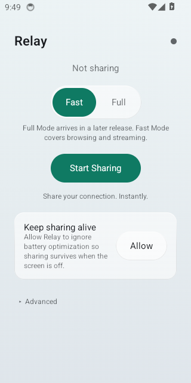
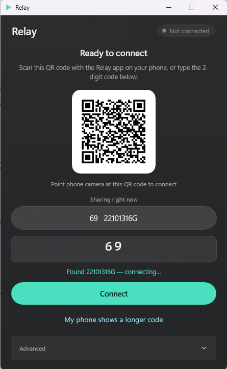
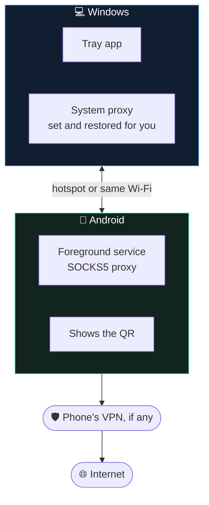

<div align="center">


&nbsp;&nbsp;&nbsp;


# Relay ⚡

### **Share your phone's internet with your PC.**
### **Scan a QR code. That's the entire setup.**

<br>

[](https://github.com/Mahdi-mortazavi/relay/releases/latest/download/Relay-Setup-x64.exe)
&nbsp;
[](https://github.com/Mahdi-mortazavi/relay/releases/latest/download/Relay-android-arm64-v8a.apk)

<sub>Always resolves to the newest release · [all files & release notes](https://github.com/Mahdi-mortazavi/relay/releases/latest)</sub>

<br>

[](https://github.com/Mahdi-mortazavi/relay/actions/workflows/ci.yml)
[](https://github.com/Mahdi-mortazavi/relay/actions/workflows/e2e.yml)
[](https://github.com/Mahdi-mortazavi/relay/actions/workflows/security.yml)

[](https://github.com/Mahdi-mortazavi/relay/releases/latest)
[](https://github.com/Mahdi-mortazavi/relay/releases)
[](https://github.com/Mahdi-mortazavi/relay/stargazers)
[](LICENSE)

[](#-install)
[](#-install)
[](android/)
[](windows/)

**🌍 [English](README.md) · [فارسی](README.fa.md)**

</div>

---

## ⚡ Sixty seconds, start to finish

<div align="center">

| 📱 On your phone | 💻 On your PC | ✅ Done |
|:---:|:---:|:---:|
| Tap **Start Sharing** | Click **Scan QR** | You're online |
| A QR code appears | Hold the phone to the webcam | Through your phone |

</div>

No account. No cloud service. No IP addresses, no port numbers, and you never open network settings on either device.

> 🔒 **Local-only. Zero telemetry.** These apps make no network connections other than relaying your own traffic between your own two devices. No analytics, no accounts, no crash reporting, no update pings. Ever.

---

## 💡 Why I built this

I kept hitting the same wall.

My phone had internet. Sometimes through a VPN. My laptop had nothing.

Sharing that connection should have taken ten seconds. It never did.

**Turning on the hotspot passed the phone's _raw_ connection through — not the VPN.** So the one thing I actually needed was the one thing it wouldn't carry.

The tools that could do better wanted an IP address, a port number, and a trip into Windows proxy settings. Every single time.

Then the phone's screen would turn off, and the whole thing would quietly die. No error. No notification. Just... nothing loading any more.

And when I was finished, the proxy I'd set by hand stayed set by hand. I'd usually discover that days later, when nothing on the laptop could reach the internet and I had no idea why.

Each of those is a small problem. Together, they meant **I just stopped bothering.**

So I built the thing I wanted to exist. 🧩

<div align="center">

### **Relay is what "share your connection" should have been all along.**

</div>

---

## 🔧 How it works



Because **the phone opens the outbound sockets**, whatever VPN is active on the phone carries your laptop's traffic too — including DNS. That is the whole trick, and it's why Relay solves the problem a hotspot cannot.

The QR carries a small versioned payload: an address, a port, and which transport to use. There is **no discovery protocol and no pairing server** — which is exactly why it still works when a VPN is up. System VPNs on Android 10+ break local network discovery, so Relay simply never discovers anything.

When you disconnect, Relay puts your Windows proxy settings back **exactly** as it found them — then reads the registry back to confirm it actually worked.

<sub>📐 Deeper detail in [`docs/architecture.md`](docs/architecture.md)</sub>

---

## 📥 Install

Two files. Nothing to compile. These links always resolve to the newest release:

| | Download | Requirements |
|:---|:---|:---|
| **💻 Windows** | [**Relay-Setup-x64.exe**](https://github.com/Mahdi-mortazavi/relay/releases/latest/download/Relay-Setup-x64.exe) | Windows 10 or 11. Per-user install — no admin prompt. |
| 💻 Windows 32-bit | [Relay-Setup-x86.exe](https://github.com/Mahdi-mortazavi/relay/releases/latest/download/Relay-Setup-x86.exe) | Only if you know you need it. |
| **📱 Android** | [**Relay-arm64-v8a.apk**](https://github.com/Mahdi-mortazavi/relay/releases/latest/download/Relay-android-arm64-v8a.apk) | Android 8.0+, 64-bit ARM — almost every phone since 2017. Enable "install from unknown sources". |
| 📱 Android (any device) | [Relay-android-universal.apk](https://github.com/Mahdi-mortazavi/relay/releases/latest/download/Relay-android-universal.apk) | Same app, every CPU type — 32-bit ARM, x86 Chromebooks, emulators. Larger. **Use this if the one above says "app not compatible".** |
| 📱 Android (stores) | [Relay-android.aab](https://github.com/Mahdi-mortazavi/relay/releases/latest/download/Relay-android.aab) | App-store bundle — not directly installable. |

> ⚠️ **SmartScreen will warn you on first run.** The Windows installer isn't code-signed yet, so click **More info → Run anyway**. Every release ships `SHA256SUMS.txt` so you can verify exactly what you downloaded. The signing work is tracked in [`docs/release.md`](docs/release.md).

---

## 🚀 Using it

1. On the phone, **turn on the hotspot** and connect the PC to it — or put both on the same Wi-Fi.
2. Open Relay on the phone → tap **Start Sharing**.
3. Open Relay on the PC (it lives in the tray) → click **Scan QR** → hold the phone up to the webcam.
   <br><sub>No webcam? Click **Enter Code Manually** and type the 8-character code under the QR. It validates as you type and connects the moment it's valid.</sub>
4. The PC says **Connected**. Use it normally. 🎉
5. Click **Disconnect** on the PC, or **Stop** on the phone, when you're done.

💤 **The phone keeps sharing with the screen off.** On first run it offers to exempt itself from battery optimisation — accept it, or Android will eventually kill the session.

📡 **Today Relay carries TCP**, which covers browsing, streaming, downloads and most apps. UDP — games, some video calls — needs the WireGuard transport, which is [on the roadmap](docs/roadmap.md) and **not in this build**. The app doesn't offer it, rather than offering it and failing.

---

## 🔐 Is it secure? An honest answer

**Short version: fine on your own hotspot. Not private on a café network.**

Relay's transport is a SOCKS5 proxy with **no authentication** — because Windows' system proxy has no way to supply credentials. So anyone else on the same network who finds the port can relay traffic through your phone.

That's a real limitation, and it deserves a straight answer instead of a footnote.

👉 **[SECURITY.md](SECURITY.md)** has the full threat model, what Relay does guarantee, and how to report a vulnerability privately.

---

## 🧪 How it's tested (this part I'm proud of)

Relay changes your operating system's network settings. "It worked on my machine" isn't good enough for that.

**Every pull request runs a device lab that GitHub builds from scratch:**

| | What actually runs |
|:---|:---|
| 📱 **Real Android** | The real APK on real emulators (API 30 + 34), driven through the real UI, relaying real HTTP through the real SOCKS5 server |
| 🔗 **Real cross-platform** | The Windows client's own code against a live phone over `adb` — the shipping decoder reads the phone's actual QR payload, real bytes cross between platforms |
| 💻 **Real installer** | Install → launch → screenshot → restore → uninstall, with the proxy registry read back and compared **after every single stage** |

And what the lab **can't** reach — a physical camera scanning a screen, WinUI control automation, Windows sleep — is written down as **blocked** in [`docs/testing.md`](docs/testing.md) instead of quietly skipped.

<sub>That last sentence is the point. A green checkmark that hides an untested path is worse than no checkmark at all.</sub>

---

## 🗺️ Roadmap

Honest status, not a wish list.

| Feature | Status |
|:---|:---|
| ⚡ Fast Mode (SOCKS5, TCP) | ✅ **Shipping** |
| 🔄 Auto-reconnect, actionable errors, EN + FA | ✅ **Shipping** |
| 🎨 Redesigned Windows app | ✅ **Shipping** |
| 🚀 Full Mode (WireGuard, TCP + UDP) | 🔨 Planned |
| 🔑 Authenticated pairing | 🔨 Planned — see [SECURITY.md](SECURITY.md) |
| ✍️ Signed Windows installer | 🔨 Planned |
| 🍎 macOS client | 💭 Later |

<sub>Detail in [`docs/roadmap.md`](docs/roadmap.md)</sub>

---

## ⭐ Star history

If Relay saved you a headache, a star genuinely helps other people find it.

<div align="center">
<a href="https://star-history.com/#Mahdi-mortazavi/relay&Date">
  <picture>
    <source media="(prefers-color-scheme: dark)" srcset="https://api.star-history.com/svg?repos=Mahdi-mortazavi/relay&type=Date&theme=dark" />
    <source media="(prefers-color-scheme: light)" srcset="https://api.star-history.com/svg?repos=Mahdi-mortazavi/relay&type=Date" />
    
  </picture>
</a>
</div>

---

<div align="center">

## 👋 Meet the developer


### **Mahdi Mortazavi** · مهدی مرتضوی

**Full-Stack Developer × Product Builder × Problem Solver**

🧩 First principles thinking → 💡 Designing solutions → 🚀 Building real products

<sub>📍 Iran</sub>

<br>

I don't build demos. I build things I need, then I make them good enough to hand to someone else.

Relay started as my own frustration. It now runs a device lab on every commit, ships signed releases on two platforms, and tells you the truth about what it can't do. **That's the standard I hold my work to.**

<br>

### 💬 Let's talk

[](https://t.me/Startup_legend)

[](https://t.me/Mahdi_mortazavi1)
&nbsp;
[](mailto:Mahdi.mortazavi.135@gmail.com)

[](https://github.com/Mahdi-mortazavi)
&nbsp;
[](https://mahdi-mortazavi.github.io)

**🚀 [Startup Legend](https://t.me/Startup_legend)** — my community, where I share what I'm building, what broke, and what I learned fixing it. Builders, founders and developers welcome.

</div>

---

<div align="center">

## 🤝 Get involved

**Found a bug?** [Open an issue](https://github.com/Mahdi-mortazavi/relay/issues/new/choose) — I read every one.

**Got an idea?** [Message me on Telegram](https://t.me/Mahdi_mortazavi1) or bring it to [the community](https://t.me/Startup_legend).

**Want to contribute?** [`CONTRIBUTING.md`](CONTRIBUTING.md) has the workflow. Good first issues are labelled.

**Just found this useful?** ⭐ Star it. It takes one click and it genuinely matters.

<br>

[](https://github.com/Mahdi-mortazavi/relay/stargazers)
&nbsp;
[](https://github.com/Mahdi-mortazavi/relay/issues/new/choose)

</div>

---

## 🛠️ For developers

<details>
<summary><b>📂 Project layout</b></summary>

<br>

```
android/   Android app (Kotlin + Jetpack Compose)
windows/   Windows tray app (.NET 8 + WinUI 3) + shared Relay.Core
shared/    Contracts both apps consume: QR schema, test vectors,
           state machine, design tokens
docs/      Architecture, ADRs, testing, security, release process
```

**Anything under `shared/` is the single source of truth.** Change it **first**, then both platforms — the unit tests on each side assert against those files, so the two implementations cannot drift apart.

</details>

<details>
<summary><b>🤖 Building Android</b></summary>

<br>

Needs JDK 17 and an Android SDK with platform 35.

```bash
cd android
./gradlew assembleDebug          # debug APK
./gradlew testDebugUnitTest      # unit tests, incl. the SOCKS5 protocol suite
```

</details>

<details>
<summary><b>🪟 Building Windows</b></summary>

<br>

The shared core is .NET 8 and runs on **any** OS:

```bash
dotnet test windows/Relay.App.Tests/Relay.App.Tests.csproj
```

The app itself needs Windows and Visual Studio's MSBuild — the WinUI 3 PRI packaging tasks aren't in the dotnet CLI's MSBuild:

```powershell
msbuild windows/Relay.App/Relay.App.csproj /restore /p:Configuration=Release /p:Platform=x64
```

</details>

<details>
<summary><b>📖 Docs worth reading</b></summary>

<br>

| Doc | What's in it |
|:---|:---|
| [`docs/architecture.md`](docs/architecture.md) | How the two apps fit together |
| [`docs/adr/`](docs/adr/) | **Why** the architecture is this way — start at ADR-0001 |
| [`docs/testing.md`](docs/testing.md) | What the device lab runs, and what it can't reach |
| [`docs/design/windows-redesign.md`](docs/design/windows-redesign.md) | The Windows UI redesign, before → after |
| [`docs/security.md`](docs/security.md) · [`SECURITY.md`](SECURITY.md) | Threat model and reporting |
| [`docs/roadmap.md`](docs/roadmap.md) | Honest status of everything planned |

</details>

---

<div align="center">

### 📄 License

[**Apache-2.0**](LICENSE) — use it, fork it, ship it.

<sub>"WireGuard" is a registered trademark of Jason A. Donenfeld.</sub>

<br>

**Built with care by [Mahdi Mortazavi](https://github.com/Mahdi-mortazavi)** 🇮🇷

<sub>If this saved you time, [tell me about it](https://t.me/Mahdi_mortazavi1). It's the best part of building things.</sub>

</div>
